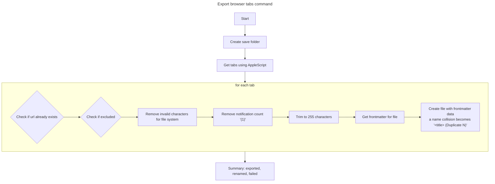
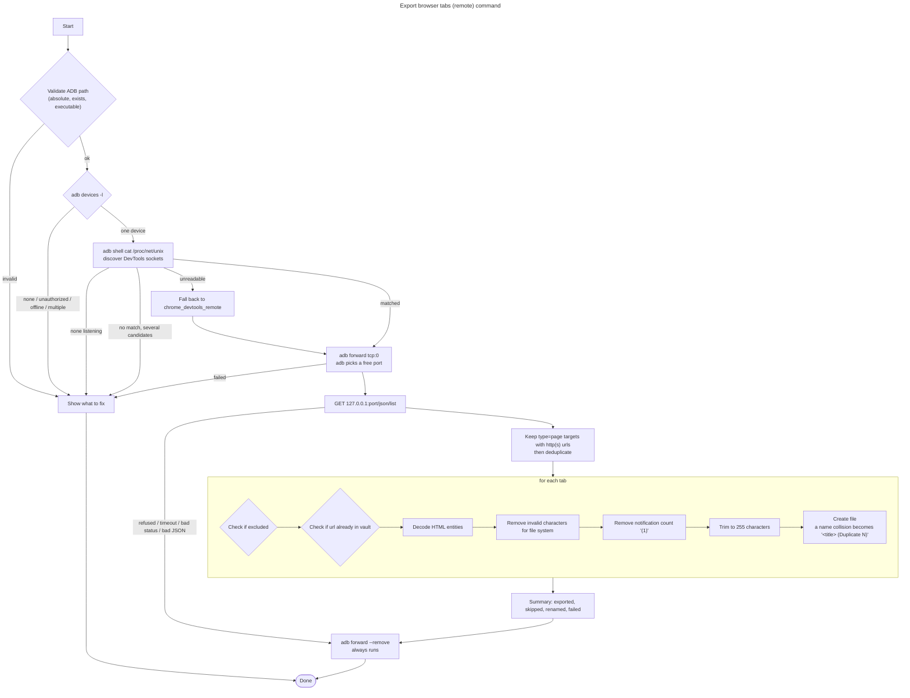

## Export (local)

## Export (remote)

The remote export talks to a browser on a connected Android device over ADB and the
Chrome DevTools Protocol. Each step is its own checked subprocess, so a failure can
say which stage broke and what to do about it.

A per-tab failure is counted and the export continues, so one bad tab cannot lose the
rest of the run.
