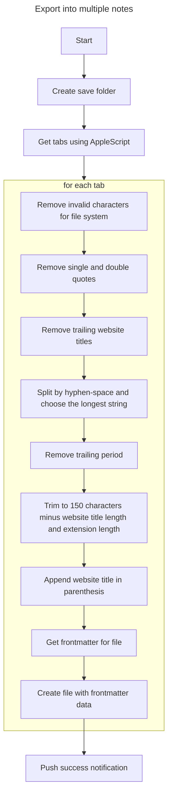

```mermaid
---
title: Export into multiple notes
---
flowchart TD
    Start --> A
	A[Create save folder] --> B[Get tabs using AppleScript]
	B --> one
	subgraph one[for each tab]
	C[Remove invalid characters for file system] --> D[Remove single and double quotes]
	D --> F[Remove trailing website titles]
	F --> G[Split by hyphen-space and choose the longest string]
	G --> H[Remove trailing period]
	H --> I[Trim to 150 characters minus website title length and extension length]
	I --> J[Append website title in parenthesis]
	J --> K[Get frontmatter for file]
	K --> L[Create file with frontmatter data]

	end
	L --> M[Push success notification]
```
