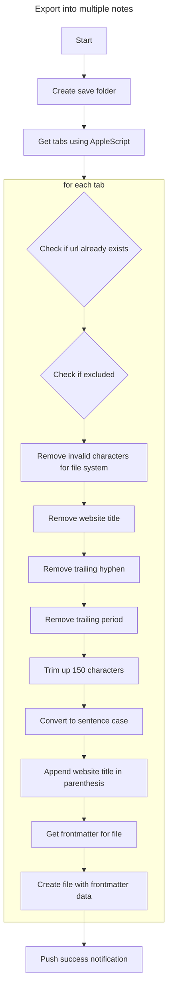

```mermaid
---
title: Export into multiple notes
---
flowchart TD
    Start --> A
	A[Create save folder] --> B[Get tabs using AppleScript]
	B --> one
	subgraph one[for each tab]
	C{Check if url already exists} --> D{Check if excluded}
	D --> E[Remove invalid characters for file system]
	E --> F[Remove website title]
	F --> G[Remove trailing hyphen]
	G --> H[Remove trailing period]
	H --> I[Trim up 150 characters]
	I --> J[Convert to sentence case]
	J --> L[Append website title in parenthesis]
	L --> M[Get frontmatter for file]
	M --> N[Create file with frontmatter data]

	end
	N --> O[Push success notification]
```
