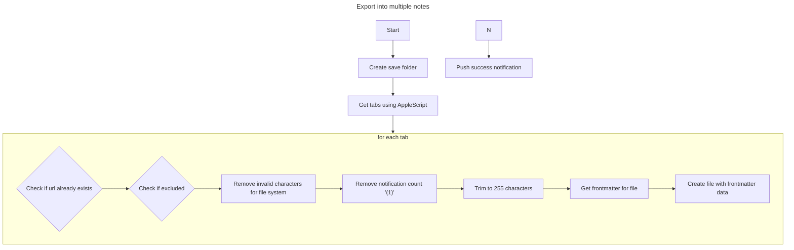

```mermaid
---
title: Export into multiple notes
---
flowchart TD
    Start --> A
	A[Create save folder] --> B[Get tabs using AppleScript]
	B --> one
	subgraph one[for each tab]
	C{Check if url already exists} --> D{Check if excluded}
	D --> E[Remove invalid characters for file system]
	E --> F["Remove notification count '(1)'"]
	F --> G[Trim to 255 characters]
	G --> H[Get frontmatter for file]
	H --> I[Create file with frontmatter data]

	end
	N --> O[Push success notification]
```
